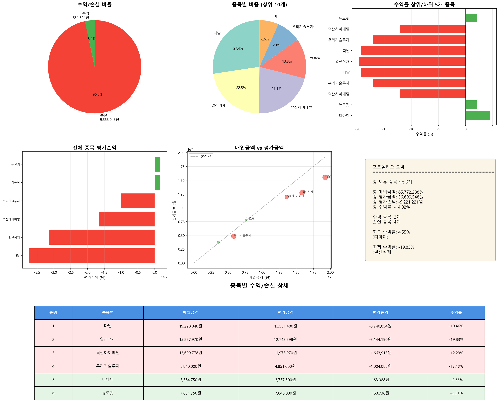

# 주식 포트폴리오 분석 리포트

**분석 일시**: 2025-11-03 19:09:49
**분석 대상 날짜**: 2025-11-03

---

## 📊 전체 포트폴리오 현황

| 항목 | 금액 |
|------|------|
| 총 보유 종목 수 | 6개 |
| 총 매입금액 | 65,772,288원 |
| 총 평가금액 | 56,699,548원 |
| 총 평가손익 | -9,221,221원 |
| 총 수익률 | -14.02% |

---

## 📈 수익/손실 분류

| 구분 | 종목 수 | 금액 |
|------|---------|------|
| 수익 종목 | 2개 | 331,824원 |
| 손실 종목 | 4개 | -9,553,045원 |

---

## 💰 종목별 수익/손실 상세

| 순위 | 종목명 | 매입금액 | 평가금액 | 평가손익 | 수익률 |
|------|--------|----------|----------|----------|--------|
| 1 | 다날 | 19,228,040원 | 15,531,480원 | -3,740,854원 | -19.46% |
| 2 | 일신석재 | 15,857,970원 | 12,743,598원 | -3,144,190원 | -19.83% |
| 3 | 덕산하이메탈 | 13,609,778원 | 11,975,970원 | -1,663,913원 | -12.23% |
| 4 | 우리기술투자 | 5,840,000원 | 4,851,000원 | -1,004,088원 | -17.19% |
| 5 | 디아이 | 3,584,750원 | 3,757,500원 | 163,088원 | +4.55% |
| 6 | 뉴로핏 | 7,651,750원 | 7,840,000원 | 168,736원 | +2.21% |

---

## 📊 수익률 분석

### 🔝 수익률 상위 5개 종목

| 순위 | 종목명 | 수익률 | 평가손익 |
|------|--------|--------|----------|
| 1 | 디아이 | +4.55% | 163,088원 |
| 2 | 뉴로핏 | +2.21% | 168,736원 |
| 3 | 덕산하이메탈 | -12.23% | -1,663,913원 |
| 4 | 우리기술투자 | -17.19% | -1,004,088원 |
| 5 | 다날 | -19.46% | -3,740,854원 |

### 📉 수익률 하위 5개 종목

| 순위 | 종목명 | 수익률 | 평가손익 |
|------|--------|--------|----------|
| 1 | 일신석재 | -19.83% | -3,144,190원 |
| 2 | 다날 | -19.46% | -3,740,854원 |
| 3 | 우리기술투자 | -17.19% | -1,004,088원 |
| 4 | 덕산하이메탈 | -12.23% | -1,663,913원 |
| 5 | 뉴로핏 | +2.21% | 168,736원 |

---

## 🎯 포트폴리오 비중

| 순위 | 종목명 | 평가금액 | 비중 |
|------|--------|----------|------|
| 1 | 다날 | 15,531,480원 | 27.39% |
| 2 | 일신석재 | 12,743,598원 | 22.48% |
| 3 | 덕산하이메탈 | 11,975,970원 | 21.12% |
| 4 | 뉴로핏 | 7,840,000원 | 13.83% |
| 5 | 우리기술투자 | 4,851,000원 | 8.56% |
| 6 | 디아이 | 3,757,500원 | 6.63% |

---

## 💳 신용거래 현황

- **신용거래 종목 수**: 6개
- **총 신용금액**: 42,263,492원
- **총 신용이자**: 45,257원

| 종목명 | 구분 | 신용금액 | 신용이자 |
|--------|------|----------|----------|
| 뉴로핏 | 신용거래 | 4,062,200원 | 5,464원 |
| 다날 | 신용거래 | 16,350,832원 | 15,818원 |
| 덕산하이메탈 | 신용거래 | 6,553,700원 | 8,332원 |
| 디아이 | 신용거래 | 2,867,800원 | 2,947원 |
| 우리기술투자 | 신용거래 | 4,672,000원 | 6,242원 |
| 일신석재 | 신용거래 | 7,756,960원 | 6,454원 |

---

## 📈 시각화 차트

---

*🤖 Generated with Claude Code*
