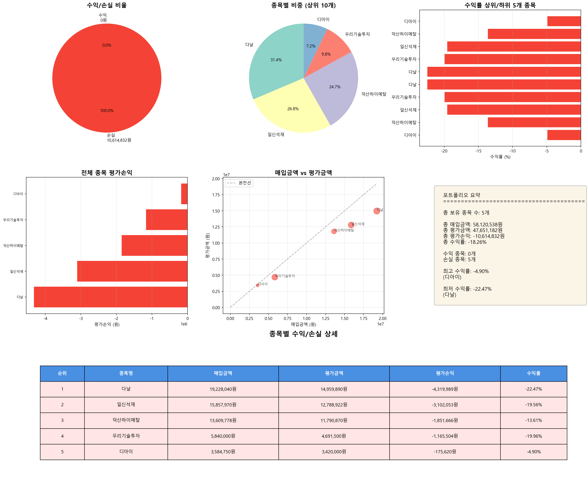

# 주식 포트폴리오 분석 리포트

**분석 일시**: 2025-11-05 15:25:40
**분석 대상 날짜**: 2025-11-05

---

## 📊 전체 포트폴리오 현황

| 항목 | 금액 |
|------|------|
| 총 보유 종목 수 | 5개 |
| 총 매입금액 | 58,120,538원 |
| 총 평가금액 | 47,651,182원 |
| 총 평가손익 | -10,614,832원 |
| 총 수익률 | -18.26% |

---

## 📈 수익/손실 분류

| 구분 | 종목 수 | 금액 |
|------|---------|------|
| 수익 종목 | 0개 | 0원 |
| 손실 종목 | 5개 | -10,614,832원 |

---

## 💰 종목별 수익/손실 상세

| 순위 | 종목명 | 매입금액 | 평가금액 | 평가손익 | 수익률 |
|------|--------|----------|----------|----------|--------|
| 1 | 다날 | 19,228,040원 | 14,959,890원 | -4,319,989원 | -22.47% |
| 2 | 일신석재 | 15,857,970원 | 12,788,922원 | -3,102,053원 | -19.56% |
| 3 | 덕산하이메탈 | 13,609,778원 | 11,790,870원 | -1,851,666원 | -13.61% |
| 4 | 우리기술투자 | 5,840,000원 | 4,691,500원 | -1,165,504원 | -19.96% |
| 5 | 디아이 | 3,584,750원 | 3,420,000원 | -175,620원 | -4.90% |

---

## 📊 수익률 분석

### 🔝 수익률 상위 5개 종목

| 순위 | 종목명 | 수익률 | 평가손익 |
|------|--------|--------|----------|
| 1 | 디아이 | -4.90% | -175,620원 |
| 2 | 덕산하이메탈 | -13.61% | -1,851,666원 |
| 3 | 일신석재 | -19.56% | -3,102,053원 |
| 4 | 우리기술투자 | -19.96% | -1,165,504원 |
| 5 | 다날 | -22.47% | -4,319,989원 |

### 📉 수익률 하위 5개 종목

| 순위 | 종목명 | 수익률 | 평가손익 |
|------|--------|--------|----------|
| 1 | 다날 | -22.47% | -4,319,989원 |
| 2 | 우리기술투자 | -19.96% | -1,165,504원 |
| 3 | 일신석재 | -19.56% | -3,102,053원 |
| 4 | 덕산하이메탈 | -13.61% | -1,851,666원 |
| 5 | 디아이 | -4.90% | -175,620원 |

---

## 🎯 포트폴리오 비중

| 순위 | 종목명 | 평가금액 | 비중 |
|------|--------|----------|------|
| 1 | 다날 | 14,959,890원 | 31.39% |
| 2 | 일신석재 | 12,788,922원 | 26.84% |
| 3 | 덕산하이메탈 | 11,790,870원 | 24.74% |
| 4 | 우리기술투자 | 4,691,500원 | 9.85% |
| 5 | 디아이 | 3,420,000원 | 7.18% |

---

## 💳 신용거래 현황

- **신용거래 종목 수**: 5개
- **총 신용금액**: 38,201,292원
- **총 신용이자**: 58,285원

| 종목명 | 구분 | 신용금액 | 신용이자 |
|--------|------|----------|----------|
| 다날 | 신용거래 | 16,350,832원 | 24,312원 |
| 덕산하이메탈 | 신용거래 | 6,553,700원 | 11,292원 |
| 디아이 | 신용거래 | 2,867,800원 | 4,700원 |
| 우리기술투자 | 신용거래 | 4,672,000원 | 8,418원 |
| 일신석재 | 신용거래 | 7,756,960원 | 9,563원 |

---

## 📈 시각화 차트

---

*🤖 Generated with Claude Code*
