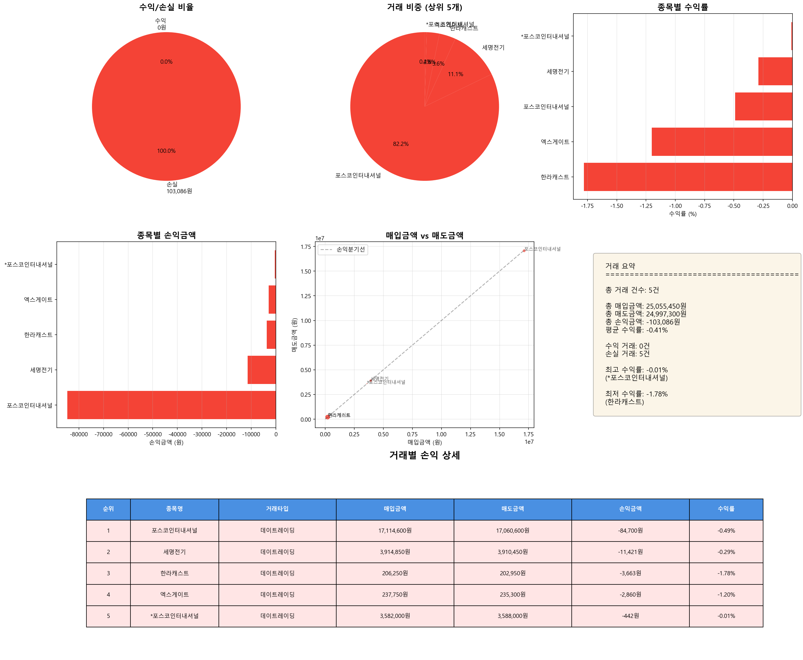

# 매도 거래 분석 리포트

**분석 일시**: 2025-11-05 16:40:49
**분석 대상 날짜**: 2025-10-23

---

## 📊 전체 거래 현황

| 항목 | 금액 |
|------|------|
| 총 거래 건수 | 5건 |
| 총 매입금액 | 25,055,450원 |
| 총 매도금액 | 24,997,300원 |
| 총 손익금액 | -103,086원 |
| 평균 수익률 | -0.41% |

---

## 🔄 거래 타입별 수익 현황

| 거래 타입 | 건수 | 손익금액 |
|-----------|------|----------|
| 데이트레이딩 | 5건 | -103,086원 |

---

## 📈 수익/손실 분류

| 구분 | 거래 건수 | 금액 |
|------|----------|------|
| 수익 거래 | 0건 | 0원 |
| 손실 거래 | 5건 | -103,086원 |

---

## 💰 거래별 손익 상세

| 1 | 포스코인터내셔널 | 데이트레이딩 | 10:01:18 | 15:15:53 | 5h 14m | 14회 | 14회 | 105,202 | 2,410 | 17,114,600원 | 17,060,600원 | -84,700원 | -0.49% |
| 2 | 세명전기 | 데이트레이딩 | 10:04:20 | 12:19:41 | 2h 15m | 10회 | 10회 | 1,717 | 1,721 | 3,914,850원 | 3,910,450원 | -11,421원 | -0.29% |
| 3 | 한라캐스트 | 데이트레이딩 | 12:34:49 | 13:07:58 | 0h 33m | 3회 | 3회 | 4,873 | 3,563 | 206,250원 | 202,950원 | -3,663원 | -1.78% |
| 4 | 엑스게이트 | 데이트레이딩 | 12:21:52 | 12:33:30 | 0h 11m | 5회 | 5회 | 2,920 | 3,888 | 237,750원 | 235,300원 | -2,860원 | -1.20% |
| 5 | *포스코인터내셔널 | 데이트레이딩 | 10:01:18 | 15:15:53 | 5h 14m | 14회 | 14회 | 105,202 | 2,410 | 3,582,000원 | 3,588,000원 | -442원 | -0.01% |

---

## 📊 수익률 분석

### 🔝 수익률 상위 5개 거래

| 순위 | 종목명 | 거래타입 | 수익률 | 손익금액 |
|------|--------|----------|--------|----------|
| 1 | *포스코인터내셔널 | 데이트레이딩 | -0.01% | -442원 |
| 2 | 세명전기 | 데이트레이딩 | -0.29% | -11,421원 |
| 3 | 포스코인터내셔널 | 데이트레이딩 | -0.49% | -84,700원 |
| 4 | 엑스게이트 | 데이트레이딩 | -1.20% | -2,860원 |
| 5 | 한라캐스트 | 데이트레이딩 | -1.78% | -3,663원 |

### 📉 수익률 하위 5개 거래

| 순위 | 종목명 | 거래타입 | 수익률 | 손익금액 |
|------|--------|----------|--------|----------|
| 1 | 한라캐스트 | 데이트레이딩 | -1.78% | -3,663원 |
| 2 | 엑스게이트 | 데이트레이딩 | -1.20% | -2,860원 |
| 3 | 포스코인터내셔널 | 데이트레이딩 | -0.49% | -84,700원 |
| 4 | 세명전기 | 데이트레이딩 | -0.29% | -11,421원 |
| 5 | *포스코인터내셔널 | 데이트레이딩 | -0.01% | -442원 |

---

## 📈 시각화 차트

---

*🤖 Generated with Claude Code*
