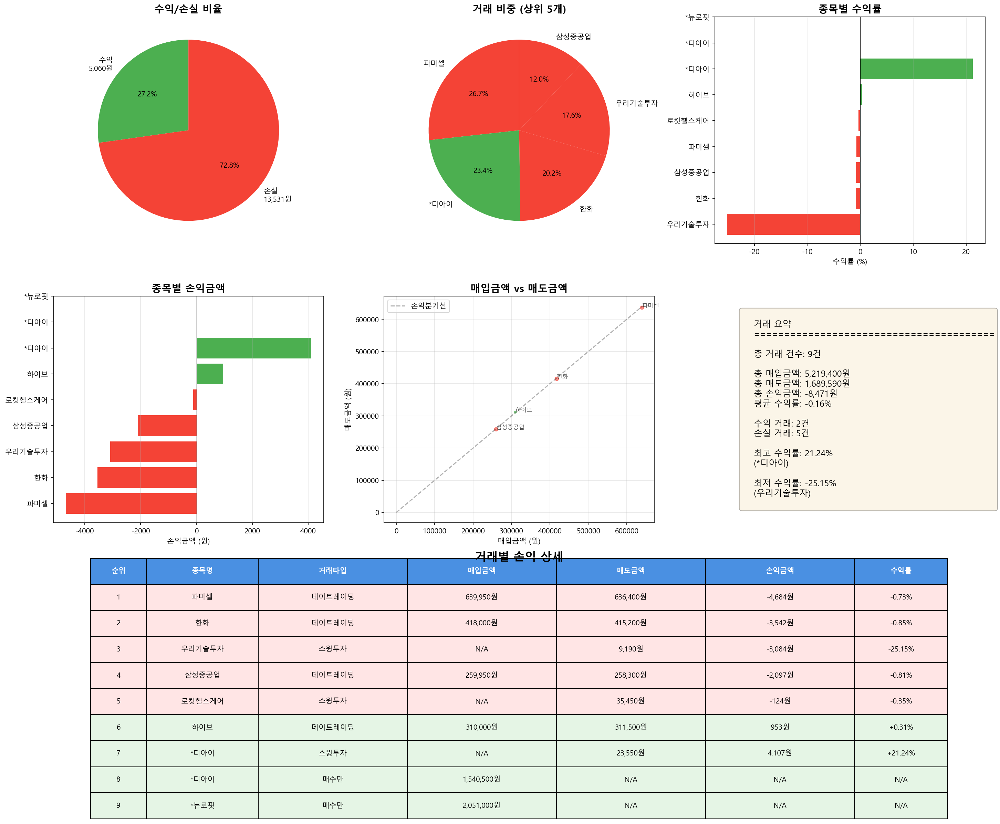

# 매도 거래 분석 리포트

**분석 일시**: 2025-11-05 16:41:09
**분석 대상 날짜**: 2025-10-27

---

## 📊 전체 거래 현황

| 항목 | 금액 |
|------|------|
| 총 거래 건수 | 9건 |
| 총 매입금액 | 5,219,400원 |
| 총 매도금액 | 1,689,590원 |
| 총 손익금액 | -8,471원 |
| 평균 수익률 | -0.16% |

---

## 🔄 거래 타입별 수익 현황

| 거래 타입 | 건수 | 손익금액 |
|-----------|------|----------|
| 데이트레이딩 | 4건 | -9,370원 |
| 스윙투자 | 3건 | 899원 |

---

## 📈 수익/손실 분류

| 구분 | 거래 건수 | 금액 |
|------|----------|------|
| 수익 거래 | 2건 | 5,060원 |
| 손실 거래 | 5건 | -13,531원 |

---

## 💰 거래별 손익 상세

| 순위 | 종목명 | 거래타입 | 시총(억) | 거래대금(억) | 매입금액 | 매도금액 | 손익금액 | 수익률 |
|------|--------|----------|----------|----------|----------|----------|----------|--------|
| 1 | 파미셀 | 데이트레이딩 | 9,999 | 2,317 | 639,950원 | 636,400원 | -4,684원 | -0.73% |
| 2 | 한화 | 데이트레이딩 | 80,356 | 1,287 | 418,000원 | 415,200원 | -3,542원 | -0.85% |
| 3 | 우리기술투자 | 스윙투자 | 7,711 | 165 | nan원 | 9,190원 | -3,084원 | -25.15% |
| 4 | 삼성중공업 | 데이트레이딩 | 256,080 | 7,632 | 259,950원 | 258,300원 | -2,097원 | -0.81% |
| 5 | 로킷헬스케어 | 스윙투자 | 5,411 | 265 | nan원 | 35,450원 | -124원 | -0.35% |
| 6 | 하이브 | 데이트레이딩 | 128,913 | 3,288 | 310,000원 | 311,500원 | 953원 | +0.31% |
| 7 | *디아이 | 스윙투자 | 6,778 | 318 | nan원 | 23,550원 | 4,107원 | +21.24% |
| 8 | *디아이 | 매수만 | 6,778 | 318 | 1,540,500원 | nan원 | nan원 | +nan% |
| 9 | *뉴로핏 | 매수만 | 2,307 | 353 | 2,051,000원 | nan원 | nan원 | +nan% |

---

## 📊 수익률 분석

### 🔝 수익률 상위 5개 거래

| 순위 | 종목명 | 거래타입 | 수익률 | 손익금액 |
|------|--------|----------|--------|----------|
| 1 | *디아이 | 스윙투자 | +21.24% | 4,107원 |
| 2 | 하이브 | 데이트레이딩 | +0.31% | 953원 |
| 3 | 로킷헬스케어 | 스윙투자 | -0.35% | -124원 |
| 4 | 파미셀 | 데이트레이딩 | -0.73% | -4,684원 |
| 5 | 삼성중공업 | 데이트레이딩 | -0.81% | -2,097원 |

### 📉 수익률 하위 5개 거래

| 순위 | 종목명 | 거래타입 | 수익률 | 손익금액 |
|------|--------|----------|--------|----------|
| 1 | 우리기술투자 | 스윙투자 | -25.15% | -3,084원 |
| 2 | 한화 | 데이트레이딩 | -0.85% | -3,542원 |
| 3 | 삼성중공업 | 데이트레이딩 | -0.81% | -2,097원 |
| 4 | 파미셀 | 데이트레이딩 | -0.73% | -4,684원 |
| 5 | 로킷헬스케어 | 스윙투자 | -0.35% | -124원 |

---

## 📈 시각화 차트

---

*🤖 Generated with Claude Code*
