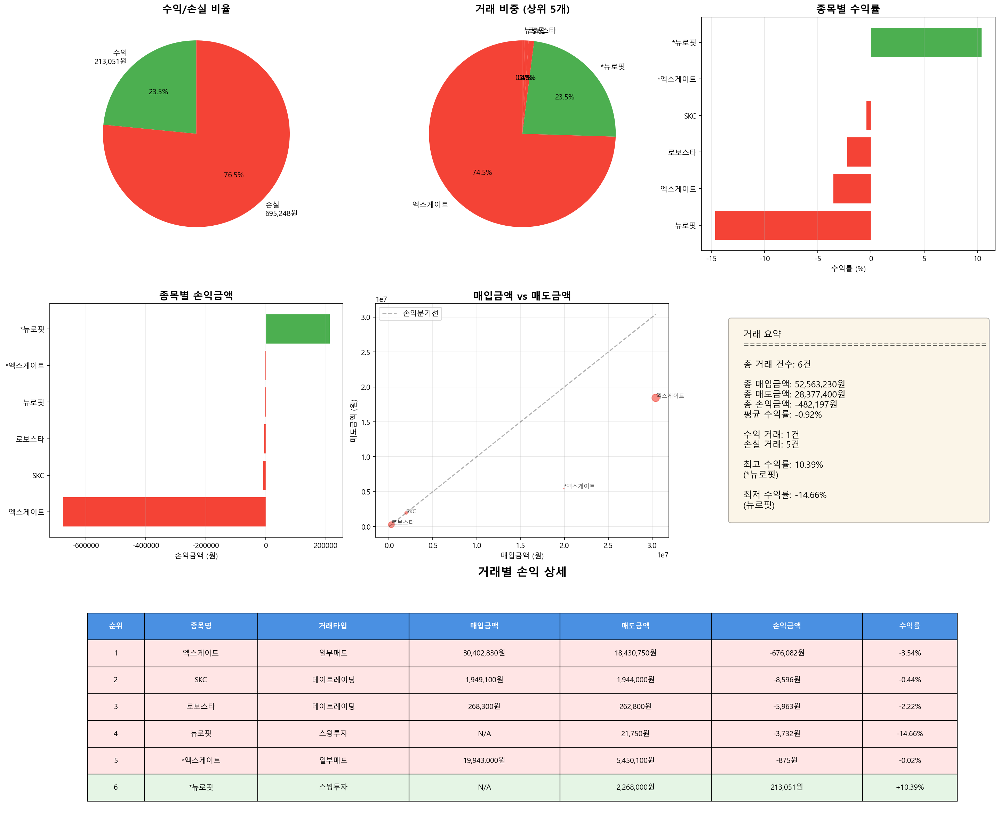

# 매도 거래 분석 리포트

**분석 일시**: 2025-11-05 16:41:16
**분석 대상 날짜**: 2025-10-28

---

## 📊 전체 거래 현황

| 항목 | 금액 |
|------|------|
| 총 거래 건수 | 6건 |
| 총 매입금액 | 52,563,230원 |
| 총 매도금액 | 28,377,400원 |
| 총 손익금액 | -482,197원 |
| 평균 수익률 | -0.92% |

---

## 🔄 거래 타입별 수익 현황

| 거래 타입 | 건수 | 손익금액 |
|-----------|------|----------|
| 데이트레이딩 | 2건 | -14,559원 |
| 일부매도 | 2건 | -676,957원 |
| 스윙투자 | 2건 | 209,319원 |

---

## 📈 수익/손실 분류

| 구분 | 거래 건수 | 금액 |
|------|----------|------|
| 수익 거래 | 1건 | 213,051원 |
| 손실 거래 | 5건 | -695,248원 |

---

## 💰 거래별 손익 상세

| 1 | 엑스게이트 | 일부매도 | 09:40:22 | 14:34:19 | 4h 53m | 33회 | 33회 | 2,720 | 1,422 | 30,402,830원 | 18,430,750원 | -676,082원 | -3.54% |
| 2 | SKC | 데이트레이딩 | 09:31:47 | 11:29:34 | 1h 57m | 9회 | 8회 | 46,124 | 2,488 | 1,949,100원 | 1,944,000원 | -8,596원 | -0.44% |
| 3 | 로보스타 | 데이트레이딩 | 10:19:57 | 10:27:02 | 0h 7m | 3회 | 3회 | 8,346 | 4,532 | 268,300원 | 262,800원 | -5,963원 | -2.22% |
| 4 | 뉴로핏 | 스윙투자 | 09:03:36 | 09:05:41 | 0h 2m | 1회 | 1회 | 2,322 | 702 | nan원 | 21,750원 | -3,732원 | -14.66% |
| 5 | *엑스게이트 | 일부매도 | 09:40:22 | 14:34:19 | 4h 53m | 33회 | 33회 | 2,720 | 1,422 | 19,943,000원 | 5,450,100원 | -875원 | -0.02% |
| 6 | *뉴로핏 | 스윙투자 | 09:03:36 | 09:05:41 | 0h 2m | 1회 | 1회 | 2,322 | 702 | nan원 | 2,268,000원 | 213,051원 | +10.39% |

---

## 📊 수익률 분석

### 🔝 수익률 상위 5개 거래

| 순위 | 종목명 | 거래타입 | 수익률 | 손익금액 |
|------|--------|----------|--------|----------|
| 1 | *뉴로핏 | 스윙투자 | +10.39% | 213,051원 |
| 2 | *엑스게이트 | 일부매도 | -0.02% | -875원 |
| 3 | SKC | 데이트레이딩 | -0.44% | -8,596원 |
| 4 | 로보스타 | 데이트레이딩 | -2.22% | -5,963원 |
| 5 | 엑스게이트 | 일부매도 | -3.54% | -676,082원 |

### 📉 수익률 하위 5개 거래

| 순위 | 종목명 | 거래타입 | 수익률 | 손익금액 |
|------|--------|----------|--------|----------|
| 1 | 뉴로핏 | 스윙투자 | -14.66% | -3,732원 |
| 2 | 엑스게이트 | 일부매도 | -3.54% | -676,082원 |
| 3 | 로보스타 | 데이트레이딩 | -2.22% | -5,963원 |
| 4 | SKC | 데이트레이딩 | -0.44% | -8,596원 |
| 5 | *엑스게이트 | 일부매도 | -0.02% | -875원 |

---

## 📈 시각화 차트

---

*🤖 Generated with Claude Code*
