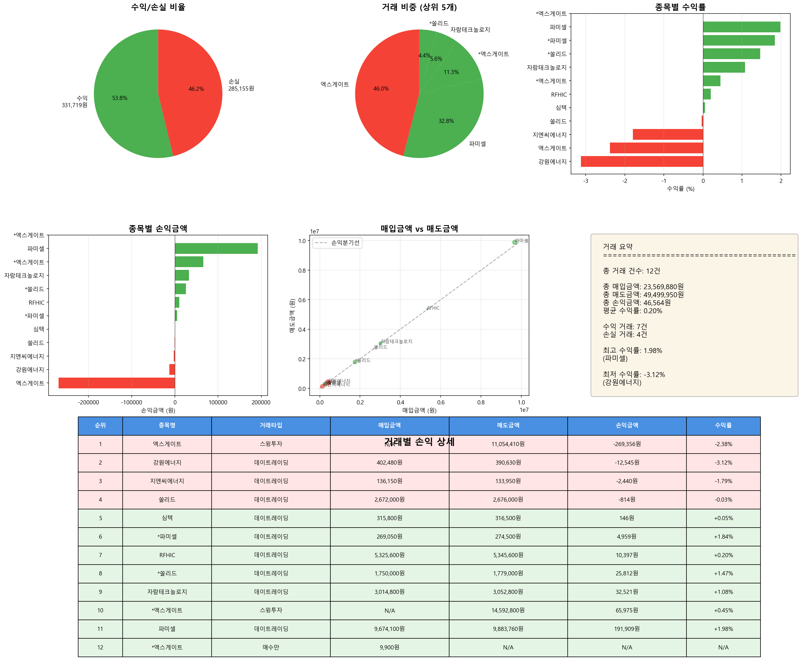

# 매도 거래 분석 리포트

**분석 일시**: 2025-11-05 16:41:23
**분석 대상 날짜**: 2025-10-29

---

## 📊 전체 거래 현황

| 항목 | 금액 |
|------|------|
| 총 거래 건수 | 12건 |
| 총 매입금액 | 23,569,880원 |
| 총 매도금액 | 49,499,950원 |
| 총 손익금액 | 46,564원 |
| 평균 수익률 | 0.20% |

---

## 🔄 거래 타입별 수익 현황

| 거래 타입 | 건수 | 손익금액 |
|-----------|------|----------|
| 데이트레이딩 | 9건 | 249,945원 |
| 스윙투자 | 2건 | -203,381원 |

---

## 📈 수익/손실 분류

| 구분 | 거래 건수 | 금액 |
|------|----------|------|
| 수익 거래 | 7건 | 331,719원 |
| 손실 거래 | 4건 | -285,155원 |

---

## 💰 거래별 손익 상세

| 순위 | 종목명 | 거래타입 | 시작시간 | 종료시간 | 보유시간 | 분할매수 | 분할매도 | 시총(억) | 거래대금(억) | 매입금액 | 매도금액 | 손익금액 | 수익률 |
|------|--------|----------|----------|----------|----------|----------|----------|----------|----------|----------|----------|----------|--------|
| 1 | 엑스게이트 | 스윙투자 | 09:10:23 | 09:15:16 | 0h 4m | 3회 | 2회 | 2,743 | 482 | nan원 | 11,054,410원 | -269,356원 | -2.38% |
| 2 | 강원에너지 | 데이트레이딩 | 09:58:02 | 12:41:37 | 2h 43m | 5회 | 5회 | 4,271 | 3,319 | 402,480원 | 390,630원 | -12,545원 | -3.12% |
| 3 | 지엔씨에너지 | 데이트레이딩 | 11:31:24 | 12:51:19 | 1h 19m | 2회 | 2회 | 7,229 | 1,922 | 136,150원 | 133,950원 | -2,440원 | -1.79% |
| 4 | 쏠리드 | 데이트레이딩 | 14:41:14 | 15:05:52 | 0h 24m | 6회 | 5회 | 5,401 | 1,843 | 2,672,000원 | 2,676,000원 | -814원 | -0.03% |
| 5 | 심텍 | 데이트레이딩 | 09:32:37 | 12:56:11 | 3h 23m | 3회 | 3회 | 22,278 | 1,322 | 315,800원 | 316,500원 | 146원 | +0.05% |
| 6 | *파미셀 | 데이트레이딩 | 09:28:31 | 11:03:33 | 1h 35m | 16회 | 15회 | 11,139 | 2,716 | 269,050원 | 274,500원 | 4,959원 | +1.84% |
| 7 | RFHIC | 데이트레이딩 | 10:15:13 | 14:46:22 | 4h 31m | 11회 | 11회 | 9,051 | 889 | 5,325,600원 | 5,345,600원 | 10,397원 | +0.20% |
| 8 | *쏠리드 | 데이트레이딩 | 14:41:14 | 15:05:52 | 0h 24m | 6회 | 5회 | 5,401 | 1,843 | 1,750,000원 | 1,779,000원 | 25,812원 | +1.47% |
| 9 | 자람테크놀로지 | 데이트레이딩 | 12:27:30 | 12:53:49 | 0h 26m | 5회 | 4회 | 2,876 | 584 | 3,014,800원 | 3,052,800원 | 32,521원 | +1.08% |
| 10 | *엑스게이트 | 스윙투자 | 09:10:23 | 09:15:16 | 0h 4m | 3회 | 2회 | 2,743 | 482 | nan원 | 14,592,800원 | 65,975원 | +0.45% |
| 11 | 파미셀 | 데이트레이딩 | 09:28:31 | 11:03:33 | 1h 35m | 16회 | 15회 | 11,139 | 2,716 | 9,674,100원 | 9,883,760원 | 191,909원 | +1.98% |
| 12 | *엑스게이트 | 매수만 | 09:10:23 | 09:15:16 | 0h 4m | 3회 | 2회 | 2,743 | 482 | 9,900원 | nan원 | nan원 | +nan% |

---

## 📊 수익률 분석

### 🔝 수익률 상위 5개 거래

| 순위 | 종목명 | 거래타입 | 수익률 | 손익금액 |
|------|--------|----------|--------|----------|
| 1 | 파미셀 | 데이트레이딩 | +1.98% | 191,909원 |
| 2 | *파미셀 | 데이트레이딩 | +1.84% | 4,959원 |
| 3 | *쏠리드 | 데이트레이딩 | +1.47% | 25,812원 |
| 4 | 자람테크놀로지 | 데이트레이딩 | +1.08% | 32,521원 |
| 5 | *엑스게이트 | 스윙투자 | +0.45% | 65,975원 |

### 📉 수익률 하위 5개 거래

| 순위 | 종목명 | 거래타입 | 수익률 | 손익금액 |
|------|--------|----------|--------|----------|
| 1 | 강원에너지 | 데이트레이딩 | -3.12% | -12,545원 |
| 2 | 엑스게이트 | 스윙투자 | -2.38% | -269,356원 |
| 3 | 지엔씨에너지 | 데이트레이딩 | -1.79% | -2,440원 |
| 4 | 쏠리드 | 데이트레이딩 | -0.03% | -814원 |
| 5 | 심텍 | 데이트레이딩 | +0.05% | 146원 |

---

## 📈 시각화 차트

---

*🤖 Generated with Claude Code*
