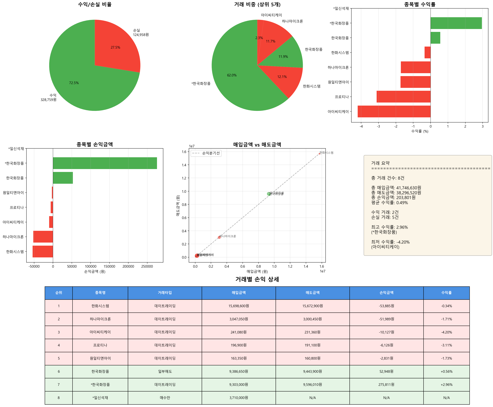

# 매도 거래 분석 리포트

**분석 일시**: 2025-11-05 16:41:45
**분석 대상 날짜**: 2025-10-30

---

## 📊 전체 거래 현황

| 항목 | 금액 |
|------|------|
| 총 거래 건수 | 8건 |
| 총 매입금액 | 41,746,630원 |
| 총 매도금액 | 38,296,520원 |
| 총 손익금액 | 203,801원 |
| 평균 수익률 | 0.49% |

---

## 🔄 거래 타입별 수익 현황

| 거래 타입 | 건수 | 손익금액 |
|-----------|------|----------|
| 데이트레이딩 | 6건 | 150,853원 |
| 일부매도 | 1건 | 52,948원 |

---

## 📈 수익/손실 분류

| 구분 | 거래 건수 | 금액 |
|------|----------|------|
| 수익 거래 | 2건 | 328,759원 |
| 손실 거래 | 5건 | -124,958원 |

---

## 💰 거래별 손익 상세

| 순위 | 종목명 | 거래타입 | 시총(억) | 거래대금(억) | 매입금액 | 매도금액 | 손익금액 | 수익률 |
|------|--------|----------|----------|----------|----------|----------|----------|--------|
| 1 | 한화시스템 | 데이트레이딩 | 119,019 | 6,463 | 15,698,600원 | 15,672,900원 | -53,885원 | -0.34% |
| 2 | 하나마이크론 | 데이트레이딩 | 20,412 | 1,852 | 3,047,050원 | 3,000,450원 | -51,989원 | -1.71% |
| 3 | 아이씨티케이 | 데이트레이딩 | 2,677 | 1,604 | 241,080원 | 231,360원 | -10,127원 | -4.20% |
| 4 | 프로티나 | 데이트레이딩 | 6,849 | 1,221 | 196,900원 | 191,100원 | -6,126원 | -3.11% |
| 5 | 원일티엔아이 | 데이트레이딩 | 2,003 | 1,459 | 163,350원 | 160,800원 | -2,831원 | -1.73% |
| 6 | 한국화장품 | 일부매도 | 2,049 | 1,409 | 9,386,650원 | 9,443,900원 | 52,948원 | +0.56% |
| 7 | *한국화장품 | 데이트레이딩 | 2,049 | 1,409 | 9,303,000원 | 9,596,010원 | 275,811원 | +2.96% |
| 8 | *일신석재 | 매수만 | 1,424 | 57 | 3,710,000원 | nan원 | nan원 | +nan% |

---

## 📊 수익률 분석

### 🔝 수익률 상위 5개 거래

| 순위 | 종목명 | 거래타입 | 수익률 | 손익금액 |
|------|--------|----------|--------|----------|
| 1 | *한국화장품 | 데이트레이딩 | +2.96% | 275,811원 |
| 2 | 한국화장품 | 일부매도 | +0.56% | 52,948원 |
| 3 | 한화시스템 | 데이트레이딩 | -0.34% | -53,885원 |
| 4 | 하나마이크론 | 데이트레이딩 | -1.71% | -51,989원 |
| 5 | 원일티엔아이 | 데이트레이딩 | -1.73% | -2,831원 |

### 📉 수익률 하위 5개 거래

| 순위 | 종목명 | 거래타입 | 수익률 | 손익금액 |
|------|--------|----------|--------|----------|
| 1 | 아이씨티케이 | 데이트레이딩 | -4.20% | -10,127원 |
| 2 | 프로티나 | 데이트레이딩 | -3.11% | -6,126원 |
| 3 | 원일티엔아이 | 데이트레이딩 | -1.73% | -2,831원 |
| 4 | 하나마이크론 | 데이트레이딩 | -1.71% | -51,989원 |
| 5 | 한화시스템 | 데이트레이딩 | -0.34% | -53,885원 |

---

## 📈 시각화 차트

---

*🤖 Generated with Claude Code*
