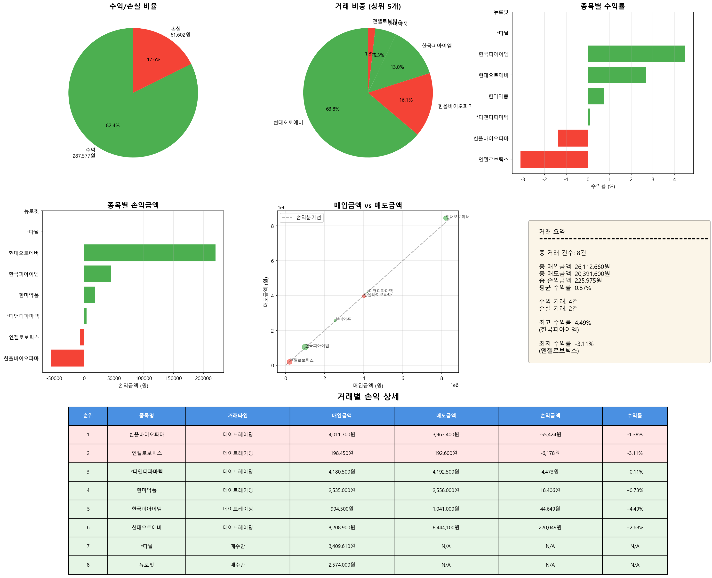

# 매도 거래 분석 리포트

**분석 일시**: 2025-11-05 16:41:52
**분석 대상 날짜**: 2025-10-31

---

## 📊 전체 거래 현황

| 항목 | 금액 |
|------|------|
| 총 거래 건수 | 8건 |
| 총 매입금액 | 26,112,660원 |
| 총 매도금액 | 20,391,600원 |
| 총 손익금액 | 225,975원 |
| 평균 수익률 | 0.87% |

---

## 🔄 거래 타입별 수익 현황

| 거래 타입 | 건수 | 손익금액 |
|-----------|------|----------|
| 데이트레이딩 | 6건 | 225,975원 |

---

## 📈 수익/손실 분류

| 구분 | 거래 건수 | 금액 |
|------|----------|------|
| 수익 거래 | 4건 | 287,577원 |
| 손실 거래 | 2건 | -61,602원 |

---

## 💰 거래별 손익 상세

| 순위 | 종목명 | 거래타입 | 시총(억) | 거래대금(억) | 매입금액 | 매도금액 | 손익금액 | 수익률 |
|------|--------|----------|----------|----------|----------|----------|----------|--------|
| 1 | 한올바이오파마 | 데이트레이딩 | 21,628 | 1,886 | 4,011,700원 | 3,963,400원 | -55,424원 | -1.38% |
| 2 | 엔젤로보틱스 | 데이트레이딩 | 4,714 | 336 | 198,450원 | 192,600원 | -6,178원 | -3.11% |
| 3 | *디앤디파마텍 | 데이트레이딩 | 30,181 | 5,767 | 4,180,500원 | 4,192,500원 | 4,473원 | +0.11% |
| 4 | 한미약품 | 데이트레이딩 | 54,447 | 2,230 | 2,535,000원 | 2,558,000원 | 18,406원 | +0.73% |
| 5 | 한국피아이엠 | 데이트레이딩 | 2,084 | 952 | 994,500원 | 1,041,000원 | 44,649원 | +4.49% |
| 6 | 현대오토에버 | 데이트레이딩 | 55,808 | 2,884 | 8,208,900원 | 8,444,100원 | 220,049원 | +2.68% |
| 7 | *다날 | 매수만 | 5,557 | 249 | 3,409,610원 | nan원 | nan원 | +nan% |
| 8 | 뉴로핏 | 매수만 | 2,553 | 478 | 2,574,000원 | nan원 | nan원 | +nan% |

---

## 📊 수익률 분석

### 🔝 수익률 상위 5개 거래

| 순위 | 종목명 | 거래타입 | 수익률 | 손익금액 |
|------|--------|----------|--------|----------|
| 1 | 한국피아이엠 | 데이트레이딩 | +4.49% | 44,649원 |
| 2 | 현대오토에버 | 데이트레이딩 | +2.68% | 220,049원 |
| 3 | 한미약품 | 데이트레이딩 | +0.73% | 18,406원 |
| 4 | *디앤디파마텍 | 데이트레이딩 | +0.11% | 4,473원 |
| 5 | 한올바이오파마 | 데이트레이딩 | -1.38% | -55,424원 |

### 📉 수익률 하위 5개 거래

| 순위 | 종목명 | 거래타입 | 수익률 | 손익금액 |
|------|--------|----------|--------|----------|
| 1 | 엔젤로보틱스 | 데이트레이딩 | -3.11% | -6,178원 |
| 2 | 한올바이오파마 | 데이트레이딩 | -1.38% | -55,424원 |
| 3 | *디앤디파마텍 | 데이트레이딩 | +0.11% | 4,473원 |
| 4 | 한미약품 | 데이트레이딩 | +0.73% | 18,406원 |
| 5 | 현대오토에버 | 데이트레이딩 | +2.68% | 220,049원 |

---

## 📈 시각화 차트

---

*🤖 Generated with Claude Code*
