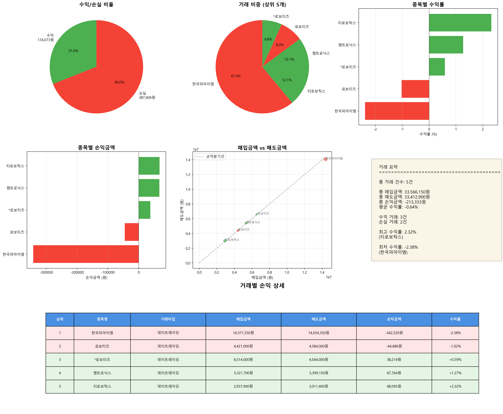

# 매도 거래 분석 리포트

**분석 일시**: 2025-11-05 11:17:19
**분석 대상 날짜**: 2025-11-03

---

## 📊 전체 거래 현황

| 항목 | 금액 |
|------|------|
| 총 거래 건수 | 5건 |
| 총 매입금액 | 33,566,150원 |
| 총 매도금액 | 33,412,900원 |
| 총 손익금액 | -213,333원 |
| 평균 수익률 | -0.64% |

---

## 🔄 거래 타입별 분류

| 거래 타입 | 건수 | 손익금액 |
|-----------|------|----------|
| 당일매수_당일매도 | 5건 | -213,333원 |

---

## 📈 수익/손실 분류

| 구분 | 거래 건수 | 금액 |
|------|----------|------|
| 수익 거래 | 3건 | 174,073원 |
| 손실 거래 | 2건 | -387,406원 |

---

## 💰 거래별 손익 상세

| 순위 | 종목명 | 거래타입 | 매입금액 | 매도금액 | 손익금액 | 수익률 |
|------|--------|----------|----------|----------|----------|--------|
| 1 | 한국피아이엠 | 당일매수_당일매도 | 14,371,550원 | 14,054,350원 | -342,520원 | -2.38% |
| 2 | 로보티즈 | 당일매수_당일매도 | 4,421,000원 | 4,384,000원 | -44,886원 | -1.02% |
| 3 | *로보티즈 | 당일매수_당일매도 | 6,514,000원 | 6,564,000원 | 38,214원 | +0.59% |
| 4 | 켐트로닉스 | 당일매수_당일매도 | 5,321,700원 | 5,399,150원 | 67,764원 | +1.27% |
| 5 | 티로보틱스 | 당일매수_당일매도 | 2,937,900원 | 3,011,400원 | 68,095원 | +2.32% |

---

## 📊 수익률 분석

### 🔝 수익률 상위 5개 거래

| 순위 | 종목명 | 거래타입 | 수익률 | 손익금액 |
|------|--------|----------|--------|----------|
| 1 | 티로보틱스 | 당일매수_당일매도 | +2.32% | 68,095원 |
| 2 | 켐트로닉스 | 당일매수_당일매도 | +1.27% | 67,764원 |
| 3 | *로보티즈 | 당일매수_당일매도 | +0.59% | 38,214원 |
| 4 | 로보티즈 | 당일매수_당일매도 | -1.02% | -44,886원 |
| 5 | 한국피아이엠 | 당일매수_당일매도 | -2.38% | -342,520원 |

### 📉 수익률 하위 5개 거래

| 순위 | 종목명 | 거래타입 | 수익률 | 손익금액 |
|------|--------|----------|--------|----------|
| 1 | 한국피아이엠 | 당일매수_당일매도 | -2.38% | -342,520원 |
| 2 | 로보티즈 | 당일매수_당일매도 | -1.02% | -44,886원 |
| 3 | *로보티즈 | 당일매수_당일매도 | +0.59% | 38,214원 |
| 4 | 켐트로닉스 | 당일매수_당일매도 | +1.27% | 67,764원 |
| 5 | 티로보틱스 | 당일매수_당일매도 | +2.32% | 68,095원 |

---

## 📈 시각화 차트

---

*🤖 Generated with Claude Code*
