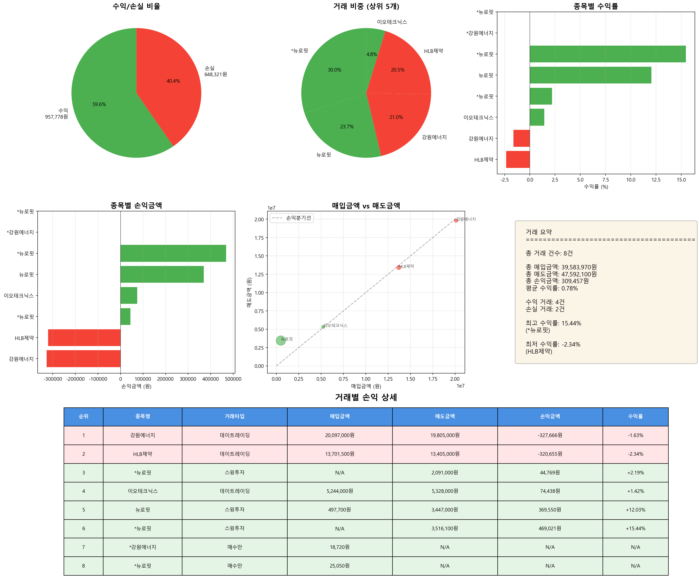

# 매도 거래 분석 리포트

**분석 일시**: 2025-11-05 01:30:34
**분석 대상 날짜**: 2025-11-04

---

## 📊 전체 거래 현황

| 항목 | 금액 |
|------|------|
| 총 거래 건수 | 4건 |
| 총 매입금액 | 39,583,970원 |
| 총 매도금액 | 47,592,100원 |
| 총 손익금액 | 309,457원 |
| 수수료/세금 | 90,693원 |
| 순손익금액 | 218,764원 |
| 평균 수익률 | 0.78% |

---

## 📈 수익/손실 분류

| 구분 | 거래 건수 | 금액 |
|------|----------|------|
| 수익 거래 | 2건 | 957,778원 |
| 손실 거래 | 2건 | -648,321원 |

---

## 💰 거래별 손익 상세

| 순위 | 종목명 | 매입금액 | 매도금액 | 손익금액 | 수익률 |
|------|--------|----------|----------|----------|--------|
| 1 | 강원에너지 | 20,115,720원 | 19,805,000원 | -327,666원 | -1.63% |
| 2 | HLB제약 | 13,701,500원 | 13,405,000원 | -320,655원 | -2.34% |
| 3 | 이오테크닉스 | 5,244,000원 | 5,328,000원 | 74,438원 | +1.42% |
| 4 | 뉴로핏 | 522,750원 | 9,054,100원 | 883,340원 | +168.98% |

---

## 📊 수익률 분석

### 🔝 수익률 상위 5개 거래

| 순위 | 종목명 | 수익률 | 손익금액 |
|------|--------|--------|----------|
| 1 | 뉴로핏 | +168.98% | 883,340원 |
| 2 | 이오테크닉스 | +1.42% | 74,438원 |
| 3 | 강원에너지 | -1.63% | -327,666원 |
| 4 | HLB제약 | -2.34% | -320,655원 |

### 📉 수익률 하위 5개 거래

| 순위 | 종목명 | 수익률 | 손익금액 |
|------|--------|--------|----------|
| 1 | HLB제약 | -2.34% | -320,655원 |
| 2 | 강원에너지 | -1.63% | -327,666원 |
| 3 | 이오테크닉스 | +1.42% | 74,438원 |
| 4 | 뉴로핏 | +168.98% | 883,340원 |

---

## 💳 신용거래 내역

- **신용거래 건수**: 2건

| 종목명 | 손익금액 | 수익률 |
|--------|----------|--------|
| 강원에너지 | -327,666원 | -1.63% |
| 뉴로핏 | 883,340원 | +168.98% |

---

## 📈 시각화 차트

---

*🤖 Generated with Claude Code*
